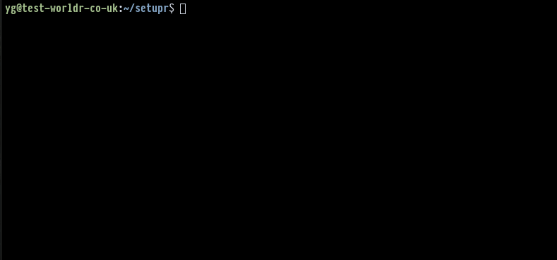

# setupr

***Setupr ships the Worldr infrastructure…***

## Setupr: The New Way

A installing is as simple as running two commands:

1. `pip install setupr` to install setupr itself.
1. `setupr -i 1.2.3` for installing version `1.2.3`.

Note that currently setupr does not execute the installation script. This
feature is coming soon…

## The Old Way

This is what the `worldr_setup.bash` (in gitops) script did:

* Install GPG Worldr key & install GPG if needed.
* Downloads & verify the infrastructure installation script.
* Downloads & verify the debug script.
* Downloads & verify the backup & restore script.
* Downloads & installs [goss](https://github.com/aelsabbahy/goss).
* Runs security pre-flight checks.
* Runs infrastructure pre-flight checks.
* Verifies that all downloaded scripts are `bash` ones.

When we install it (via `curl`), we need to check its `sha256sum` which is
cumbersome.
